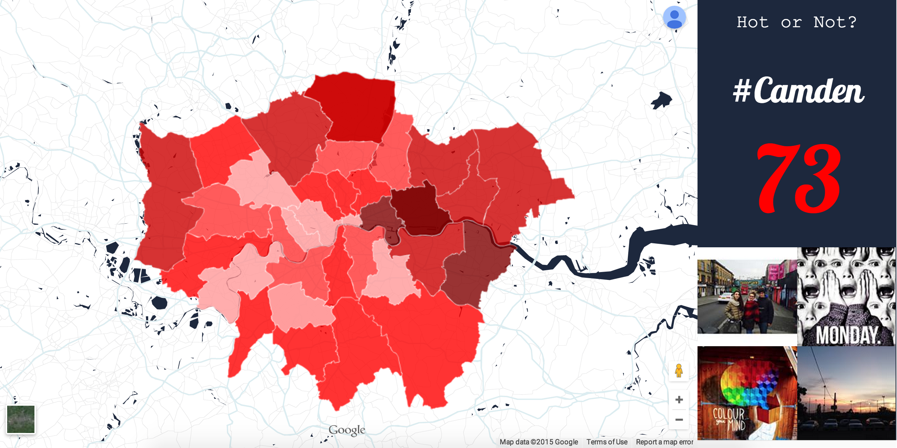

[](https://codeclimate.com/github/kierangoodacre/london_gents)
[](https://codeclimate.com/github/kierangoodacre/london_gents)

Hipsterfication
=======================

Introduction
--------------------

For our mini Makerthon project we set about making a data representation website that clearly shows where London's most trendy, up-and-coming areas are.

We were able to build an algorithm that gave us an index of 'trendiness' based on freely available government data such as changes in house pricing and the change in the number of 20-30 year olds in the area. Using this index we created a choropleth map of London that uses colours to demonstrate where these up-and-coming locations lie.

We also utilised Instagram's API to show the latest images hashtagged under the area names for the district you clicked on, this we felt would provide some more background to the culture and happenings of that chosen area.

Link
---------------
View live at:<br> [https://london-hipsterfication.herokuapp.com/](https://london-hipsterfication.herokuapp.com/)

Screenshot
---------------



Contributors
--------------------

- Gus Powell https://github.com/guspowell
- Kieran Goodacre https://github.com/kierangoodacre
- Josh Bebbington https://github.com/bebbs
- Johnny Lakin https://github.com/jjlakin
- Jake Alvarez https://github.com/jakealvarez

Languages - Frameworks - Tools
--------------------------------

javaScript,
nodeJs,
jQuery,
Google Maps API,
Instagram API,
Yelp API,
CSS,
Hippie,
Moustache,
Grunt

Instructions
------------------
```npm install``` download bundle

```npm test``` will run hippie and it's API tests

Highlights
-----------------

The teams highlights included completing a working single page web application, which we can proudly say, is a very tidy looking and functional MVP.

Personally highlights for me were...

Front end styling to a give a great visual representation of London's trendy areas.

Increasing my knowledge of making requests to web based API's using jQuery and Ajax.

Combining both Google Maps API and Instagrams API to work asynchronously on the page.

Enhancements
------------------

More granular data on the index scoring system, currently we are using change in house prices and age, we would like to use more fators such as liscenced premises, number of shops, coffee houses and places of cultural significance

Incorperate more data from community based web applications such as Reddit & Yelp

Break the map down to postcodes

Improve lay out and context, so user can understand more what the data represents
